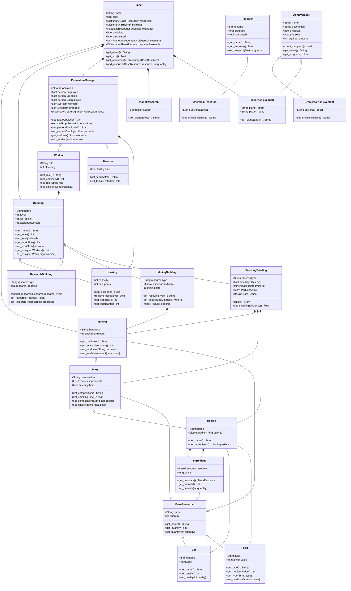

# ClassDiagram

```mermaid
classDiagram
    Planet *-- Mineral
    Planet *-- Building
    Planet *-- PopulationManager
    Planet *-- PlanetResearch
    Planet *-- PlanetAchievement

    Building <|-- Housing
    Building <|-- ResearchBuilding
    Building <|-- MiningBuilding
    Building <|-- SmeltingBuilding

    BaseResource <|-- Mineral
    BaseResource <|-- Bar
    BaseResource <|-- Alloy
    BaseResource <|-- Food

    Recipe *-- Ingredient
    Ingredient --> BaseResource

    Mineral <|-- Alloy
    Alloy o-- Recipe
    Food o-- Recipe
    Bar o-- Recipe

    PopulationManager o-- Worker
    PopulationManager o-- Breeder

    Worker *-- Building
    PopulationManager *-- Housing

    Research <|-- UniversalResearch

    Achievement <|-- UniversalAchievement
    Achievement <|-- PlanetAchievement

    MiningBuilding *-- Mineral
    SmeltingBuilding *-- Mineral
    SmeltingBuilding *-- Alloy
    SmeltingBuilding *-- Recipe
    Recipe *-- Ingredient

    class Planet{
        +String name
        +float size
        +Dictionary~BaseResource~ resources
        +Dictionary~Building~ buildings
        +PopulationManager populationManager
        +bool unlocked
        +bool discovered
        +List~PlanetAchievement~ planetAchievements
        +Dictionary~PlanetResearch~ planetResearch
        +get_name() String
        +get_size() float
        +get_resources() Dictionary~BaseResource~
        +add_resource(BaseResource resource, int quantity)
    }

    class BaseResource{
        +String name
        +int quantity
        +get_name() String
        +get_quantity() int
        +set_quantity(int quantity)
    }

    class Alloy{
        +String composition
        +List~Recipe~ ingredients
        +float smeltingTime
        +get_composition() String
        +get_smeltingTime() float
        +set_composition(String composition)
        +set_smeltingTime(float time)
    }

    class Mineral{
        +String hardness
        +int availableAmount
        +get_hardness() String
        +get_availableAmount() int
        +set_hardness(String hardness)
        +set_availableAmount(int amount)
    }

    class Food{
        +String type
        +int nutritionValue
        +get_type() String
        +get_nutritionValue() int
        +set_type(String type)
        +set_nutritionValue(int value)
    }

    class Bar{
        +String name
        +int quality
        +get_name() String
        +get_quality() int
        +set_quality(int quality)
    }

    class Building{
        +String name
        +int level
        +int workSlots
        +int assignedWorkers
        +get_name() String
        +get_level() int
        +set_level(int level)
        +get_workSlots() int
        +set_workSlots(int slots)
        +get_assignedWorkers() int
        +set_assignedWorkers(int workers)
    }

    class MiningBuilding{
        +String resourceType
        +Mineral associatedMineral
        +int miningRate
        +get_resourceType() String
        +get_associatedMineral() Mineral
        +mine() BaseResource
    }

    class SmeltingBuilding{
        +String processType
        +float smeltingEfficiency
        +Mineral associatedMineral
        +Alloy producesAlloy
        +Recipe usesRecipe
        +smelt() Alloy
        +get_smeltingEfficiency() float
    }

    class Housing{
        +int capacity
        +int occupants
        +add_occupant() void
        +remove_occupant() void
        +get_capacity() int
        +get_occupants() int
    }

    class ResearchBuilding{
        +String researchType
        +float researchProgress
        +conduct_research(Research research) void
        +get_researchProgress() float
        +set_researchProgress(float progress)
    }

    class PopulationManager {
        +int totalPopulation
        +float percentEmployed
        +float percentBreeding
        +float percentUnemployed
        +List~Worker~ workers
        +List~Breeder~ breeders
        +Dictionary~JobAssignment~ jobAssignments
        +get_totalPopulation() int
        +set_totalPopulation(int population)
        +get_percentEmployed() float
        +set_percentEmployed(float percent)
        +get_workers() List~Worker~
        +add_worker(Worker worker)
    }

    class Worker{
        +String role
        +int efficiency
        +get_role() String
        +get_efficiency() int
        +set_role(String role)
        +set_efficiency(int efficiency)
    }

    class Breeder{
        +float fertilityRate
        +get_fertilityRate() float
        +set_fertilityRate(float rate)
    }

    class Recipe{
        +String name
        +List~Ingredient~ ingredients
        +get_name() String
        +get_ingredients() List~Ingredient~
    }

    class Ingredient{
        +BaseResource resource
        +int quantity
        +get_resource() BaseResource
        +get_quantity() int
        +set_quantity(int quantity)
    }

    class Achievement{
        +String name
        +String description
        +bool unlocked
        +float progress
        +int required_amount
        +check_progress() void
        +get_name() String
        +get_progress() float
    }

    class UniversalAchievement{
        +String universal_effect
        +get_universalEffect() String
    }

    class PlanetAchievement{
        +String planet_effect
        +String planet_name
        +get_planetEffect() String
    }

    class Research{
        +String name
        +float progress
        +bool completed
        +get_name() String
        +get_progress() float
        +set_progress(float progress)
    }

    class UniversalResearch{
        +String universalEffect
        +get_universalEffect() String
    }

    class PlanetResearch{
        +String planetEffect
        +get_planetEffect() String
    }

```
